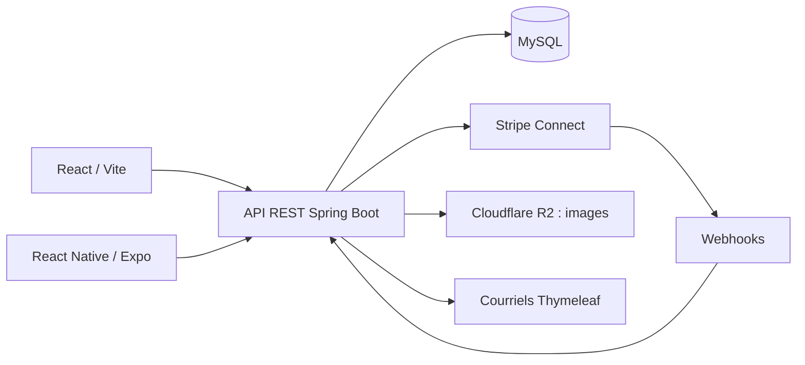

# Projets : contexte, réalisation et preuves

Documentation établie le 15 septembre 2026, section RZO mise à jour le 6 octobre 2026, à partir des dépôts locaux et du récit fourni par Azzam et son cofondateur. Elle explique les choix présentés ; elle ne constitue pas un audit complet de RZO.

## RZO Sports — produit et entreprise

Section mise à jour le 6 octobre 2026 à partir des trois dépôts locaux (`RZO-SPORTS-CLIENT`, `RZO-SPORTS-SERVER`, `RZO-SPORTS-MOBILE`, branche `main`) et du site en ligne rzosports.com. Elle explique les choix présentés ; elle ne constitue pas un audit complet de RZO. Les dépôts sont privés : le portfolio ne renvoie plus vers le code, mais vers l’offre publique pour les complexes.

### Problème et ambition

Les joueurs veulent trouver un terrain, réserver et organiser une partie au même endroit. Les installations veulent gérer horaires, paiements et équipes. RZO rassemble ces deux parcours.

Azzam a cofondé le projet avec Mehdi Semmar. Startup Garage à l’Université d’Ottawa a permis de développer plan d’affaires, étude de marché et identité. L’équipe a terminé deuxième sur 40 au concours de pitch devant quatre investisseurs. Des entretiens avec les centres ont orienté le premier produit. RZO a aussi été présenté à Shopify Builders ; l’entreprise RZO Sports Inc. a ensuite été incorporée.

L’ambition est de transformer le sport et la communauté à Ottawa–Gatineau. Le portfolio ne la confond pas avec un impact déjà mesuré. L’acquisition de partenaires reste un travail en cours ; aucun nombre de complexes, de réservations ou de revenus n’est annoncé.

### Modèle

Aucun abonnement ni frais fixes pour les complexes ; des frais de service RZO de 1 % s’ajoutent au prix payé par les joueurs (`venuesPage.model` dans `RZO-SPORTS-CLIENT/src/locales/fr.json`, `PlatformFeeService.java`).

### Parcours

| Joueurs | Complexes |
| --- | --- |
| Recherche par sport et proximité, créneaux réellement libres | Agenda hebdomadaire, réservation au comptoir |
| Parties publiques ou privées, demandes de participation | Approbation manuelle ou automatique |
| Partage des frais, prix par joueur | Clients réguliers sur plages récurrentes |
| Carte, Apple Pay, Google Pay, Link (web) | Règles : pas de temps, durées, délais, nettoyage, fermetures |
| Préautorisation 6 jours avant, débit après | Rôles et 20 permissions, plusieurs complexes par compte |
| Alertes hebdomadaires de disponibilités | Statistiques, projections, Stripe Connect, taxes de vente |

### Architecture

### Preuves

| Sujet | Fichiers |
| --- | --- |
| Stack web | `RZO-SPORTS-CLIENT/package.json` : React, React Router, Tailwind, Radix, i18next, Stripe, Recharts |
| Nouvelles pages vitrines | `src/pages/HomePage.jsx`, `AboutPage.jsx`, `ForVenuesPage.jsx` (commits du 28 septembre au 5 octobre 2026) |
| App mobile | `RZO-SPORTS-MOBILE/package.json`, `README.md` : Expo, Expo Router, TypeScript, Stripe React Native, jeton dans `expo-secure-store` |
| QR code d’entrée | Mobile : commits `d383aa5`, `e458fed` sur `main` ; serveur : branche non fusionnée, d’où « en cours d’intégration » |
| Préautorisations | `service/payment/BookingHoldService.java` (`HOLD_WINDOW` de 6 jours), `CardHoldClient.java`, `ConnectService.java` |
| Disponibilités | `service/scheduling/`, `service/booking/BookingService.java` |
| Alertes | `service/availabilityalert/`, `docs/availability-alerts.md` |
| Conformité | `docs/legal-compliance.md` : consentements, entente partenaire, suppression anonymisée |
| Accès | `service/security/`, `spring-boot-starter-oauth2-client` |
| Tests | 47 fichiers et environ 300 annotations `@Test` sous `server/src/test` ; PIT configuré dans `server/build.gradle` |
| Exploitation | `deployment/docker-compose.yml` (Nginx, Let’s Encrypt), `service/r2/` |

Les tests RZO n’ont pas été exécutés pendant la mise à jour du portfolio ; aucun taux de couverture n’est annoncé.

### Contribution

Le rôle présenté est « cofondateur et développeur full-stack ». L’équipe comporte deux cofondateurs. Aucun module n’est attribué exclusivement à Azzam sans relevé de contribution individuel.

## Overy — plateforme multijoueur Minecraft

Deuxième projet de la sélection, après RZO. Source : CV `01_software_backend.pdf` et confirmation d’Azzam du 17 septembre 2026, voir [SOURCES.md](SOURCES.md).

- **Rôle :** fondateur et développeur principal.
- **Réalisation :** plugins Java, services backend PHP/Node.js, conception et maintenance de la base MySQL ; boutique mise en place et administrée sur Tebex.
- **Données et produit :** création et utilisation d’outils statistiques pour analyser achats et activité, adapter les offres et prioriser les fonctionnalités.
- **Exploitation et équipe :** direction de développeurs et designers, roadmap, revues de code et déploiements en production.
- **Résultats du récit fourni :** milliers d’utilisateurs accueillis, chiffre d’affaires cumulé à cinq chiffres, top 7 mondial atteint dans son segment.

La présentation met en avant les responsabilités et résultats dès la synthèse. L’étude de cas dépliable raconte le passage du serveur Minecraft au produit logiciel, puis le développement, l’analyse des données, la boutique, l’exploitation et le travail d’équipe. Elle contient une capture mobile réelle du catalogue OveryCoins, datée et agrandissable. Les liens vers Tebex et la fiche publique du serveur sont accessibles sans ouvrir l’étude de cas. Les chiffres viennent du CV et du récit confirmé par Azzam ; ce document ne prétend pas constituer un audit des données de production.

Une illustration SVG du réseau multi-serveurs est désormais visible dès la présentation (6 octobre 2026). Elle reprend le proxy, le lobby, les mini-jeux, les modes de jeu et les données MySQL partagées dans une esthétique de blocs. Elle est identifiée comme une illustration, distincte de la capture réelle de la boutique.

## Drone autonome — Capstone

Remplace Sports Facility Discovery à la demande d’Azzam le 6 octobre 2026. Source : `Azzam_El_Kettani_Resume (2).pdf`, fourni pour cette modification.

Projet de fin d’études en cours depuis septembre 2026, dans une équipe de cinq. Azzam est responsable des commandes de vol et de la simulation PX4 SITL dans Gazebo, ainsi que de l’intégration MAVLink / ROS 2 avec un Raspberry Pi 5. Le drone de l’équipe combine vision accélérée sur FPGA et imagerie thermique ; ces deux sous-systèmes ne sont pas attribués personnellement à Azzam. Aucun essai en vol réussi ni résultat final n’est annoncé. Présentation et étude de cas disponibles en français et en anglais.

## Tacozzo — site vitrine de restaurant (réalisation complémentaire)

### Objectif

Faire découvrir les plats, exprimer l’identité et guider vers la commande. Uber Eats assure la commande et son règlement ; le site n’implémente pas de paiement.

### Structure et décisions

- `index.html` : contenu sémantique, plats phares en HTML, coordonnées, actions et métadonnées.
- `menu-data.json` : données du menu filtrable.
- `script.js` : filtres, navigation mobile, galerie et clavier.
- `styles.css` : typographie, identité jaune/noir et responsive.
- `public/fonts/` : polices locales ; `public/images/` : médias dont les WebP.
- `vite.config.js` : build statique, base `/` par défaut, préfixe GitHub via `build:github`.
- `wrangler.jsonc` : distribution statique Cloudflare.

### Modification livrée

Carte de partage PNG 1200 × 630, balises Open Graph / Twitter, canonical et URL absolues. L’image reprend une photo existante et l’identité du restaurant. Les robots découvrent les balises directement dans le HTML. Voir `SOCIAL-PREVIEW.md` dans le dépôt Tacozzo pour le prompt, la configuration et la validation.

## Lyz Barbier — site vitrine de salon (réalisation complémentaire)

### Objectif

Présenter le lieu, l’équipe et les réalisations, puis conduire vers la réservation chez le bon barbier. Le parcours final utilise Squire.

### Structure et décisions

- `index.html` : entrée Homme / Femme, lieu, avis et vidéos.
- `hommes/index.html` : prestations, équipe et réalisations.
- `script.js` : navigation, filtres et galerie.
- `media.js` : chargement des vidéos au clic, pause hors écran ou lors d’une autre lecture, erreurs.
- `fonts.css`, `styles.css` : polices locales et identité.
- `public/videos/` : fichiers locaux pour éviter les liens de médias temporaires.
- `SOURCES.md` : provenance des contenus et limites.

L’espace Femme reste « Bientôt ». Les avis sont sélectionnés, sans synchronisation automatique. Les profils Squire assurent les rendez-vous. Le code de Lyz n’est pas modifié par cette intervention ; sa capture et son étude de cas sont intégrées au portfolio.
