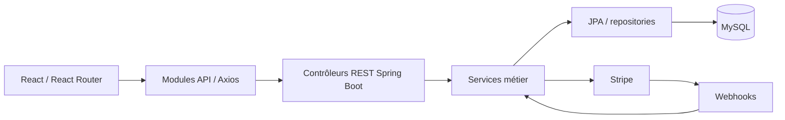

# Projets : contexte, réalisation et preuves

Documentation établie le 15 septembre 2026 à partir des dépôts locaux et du récit fourni par Azzam et son cofondateur. Elle explique les choix présentés ; elle ne constitue pas un audit complet de RZO.

## RZO Sports — produit et entreprise

### Problème et ambition

Les joueurs veulent trouver un terrain, réserver et organiser une partie au même endroit. Les installations veulent gérer horaires, paiements et équipes. RZO rassemble ces deux parcours.

Azzam a cofondé le projet avec Mehdi Semmar. Startup Garage à l’Université d’Ottawa a permis de développer plan d’affaires, étude de marché et identité. L’équipe a terminé deuxième sur 40 au concours de pitch devant quatre investisseurs. Des entretiens avec les centres ont orienté le premier produit. RZO a aussi été présenté à Shopify Builders ; l’entreprise a ensuite été incorporée.

L’ambition est de transformer le sport et la communauté à Ottawa–Gatineau. Le portfolio ne la confond pas avec un impact déjà mesuré. L’acquisition de partenaires reste un travail en cours.

### Parcours

| Joueurs | Gestionnaires |
| --- | --- |
| Découverte des installations | Configuration du centre et des terrains |
| Réservations et récurrence | Agenda, horaires et fermetures |
| Parties publiques ou privées | Réservations et paiements |
| Demandes de participation | Tableaux de bord et statistiques |
| Partage des frais | Rôles et permissions des employés |
| Avis sur les centres | Présentation publique du centre |

### Architecture

Le client sépare pages, composants, contextes et appels réseau. Le serveur distingue frontières HTTP, règles métier et persistance. Les technologies sont relevées dans les manifests et les sources, pas déduites du visuel.

### Preuves côté client

Chemins relatifs à `RZO-SPORTS-CLIENT`, consulté dans le dossier RZOSPORTS voisin de Sites Webs.

| Sujet | Fichiers |
| --- | --- |
| Stack frontend | `package.json` : React, React Router, Axios, Tailwind, i18next, Stripe, Recharts |
| Découverte locale | `src/pages/HomePage.jsx` : sports et filtre Ottawa/Gatineau |
| Réservation | `src/pages/BookFieldPage.jsx`, `BookFieldWizard.jsx`, `MyBookingsPage.jsx` |
| Parties | `src/pages/CreateGamePage.jsx`, `MyGamesPage.jsx`, `MyJoinedGamesPage.jsx` |
| Gestion | `src/pages/VenueDashboardPage.jsx`, `VenueAgendaPage.jsx`, `VenueStatisticsPage.jsx` |
| Horaires | `src/pages/VenueSchedulingConfigPage.jsx`, `VenueClosuresPage.jsx`, `FieldUnavailabilitiesPage.jsx` |
| Collaborateurs | `src/pages/VenueRolesPage.jsx`, `VenueManagersPage.jsx` |
| Appels réseau | `src/api/bookingApi.js`, `gameApi.js`, `gameJoinApi.js`, `paymentApi.js`, `schedulingApi.js` |
| Traductions | `src/contexts/I18nContext.jsx`, `src/locales/fr.json`, `src/locales/en.json` |

### Preuves côté serveur

Chemins relatifs à `RZO-SPORTS-SERVER`. Les chemins abrégés `service/` ci-dessous se trouvent sous `server/src/main/java/org/rzosport/`.

| Sujet | Fichiers |
| --- | --- |
| Stack | `server/build.gradle` : Java 21, Spring Boot 3.2.11, Security, JPA, MySQL, Stripe |
| Réservations / conflits | `service/booking/BookingService.java` |
| Disponibilités | `service/scheduling/AvailabilityService.java`, `SchedulingService.java` |
| Parties / demandes | `service/game/GameService.java`, `GameJoinRequestService.java` |
| Répartition des frais | `service/game/GamePaymentService.java` |
| Paiements | `service/payment/PaymentService.java`, `WebhookService.java` |
| Authentification | `service/security/JwtService.java`, `AuthenticationService.java`, `AuthCookieUtils.java` |
| Propriété | `service/security/BookingOwnershipService.java`, `FieldOwnershipService.java`, `VenueOwnershipService.java` |
| Permissions | `service/venue/VenuePermissionService.java`, `VenueRoleService.java` |
| Statistiques | `service/statistics/VenueStatisticsService.java`, `PlayerStatisticsService.java` |
| Environnement | `docker-compose.yml`, `server/Dockerfile`, `reverseproxy/Dockerfile.nginx`, `reverseproxy/nginx.dev.conf` |

### Choix techniques à expliquer en entretien

**Disponibilités.** Horaires récurrents, fermetures et conflits rendent le sujet plus riche qu’un simple formulaire. `BookingService` gère conflits et transitions de statut ; `AvailabilityService` porte le calcul de disponibilité.

**Sécurité.** `AuthCookieUtils` centralise HttpOnly, SameSite=Lax et Secure configurable pour le JWT. Les services vérifient propriété et permissions. Leur présence est documentée, sans revendiquer une certification de sécurité.

**Paiement partagé.** `GamePaymentService` orchestre le calcul par participant et les appels au paiement. Stripe et ses webhooks forment une intégration serveur distincte de l’affichage du résultat dans le client.

**Qualité.** Le dépôt contient notamment `AvailabilityServiceOvernightRecurringTest`, `BookingServiceStatusUpdateTests`, `GameServiceJoinRequestTests`, `VenueServiceDeleteDependenciesTests` et des tests de contrôleurs. Leur existence est vérifiée. Les tests RZO n’ont pas été exécutés pendant la refonte du portfolio ; aucun taux de couverture n’est annoncé.

### Contribution

Le rôle présenté est « cofondateur et développeur full-stack ». L’équipe comporte deux cofondateurs. Aucun module n’est attribué exclusivement à Azzam sans relevé de contribution individuel. Les fonctionnalités et le parcours entrepreneurial sont distingués.

## Overy — plateforme multijoueur Minecraft

Deuxième projet de la sélection, après RZO. Source : CV `01_software_backend.pdf` et confirmation d’Azzam du 17 septembre 2026, voir [SOURCES.md](SOURCES.md).

- **Rôle :** fondateur et développeur principal.
- **Réalisation :** plugins Java, services backend PHP/Node.js, conception et maintenance de la base MySQL ; boutique mise en place et administrée sur Tebex.
- **Données et produit :** création et utilisation d’outils statistiques pour analyser achats et activité, adapter les offres et prioriser les fonctionnalités.
- **Exploitation et équipe :** direction de développeurs et designers, roadmap, revues de code et déploiements en production.
- **Résultats du récit fourni :** milliers d’utilisateurs accueillis, chiffre d’affaires cumulé à cinq chiffres, top 7 mondial atteint dans son segment.

La présentation met en avant les responsabilités et résultats dès la synthèse. L’étude de cas dépliable raconte le passage du serveur Minecraft au produit logiciel, puis le développement, l’analyse des données, la boutique, l’exploitation et le travail d’équipe. Elle contient une capture mobile réelle du catalogue OveryCoins, datée et agrandissable. Les liens vers Tebex et la fiche publique du serveur sont accessibles sans ouvrir l’étude de cas. Les chiffres viennent du CV et du récit confirmé par Azzam ; ce document ne prétend pas constituer un audit des données de production.

## Sports Facility Discovery — données et automatisation

Troisième projet principal, personnel. Source : le même CV.

Le besoin est de repérer et qualifier des installations sportives à partir de sources dispersées. Google Places, OpenStreetMap et le web public alimentent une collecte avec enrichissement, déduplication, score de confiance et classification locale Ollama. Le résultat couvre des centaines d’installations. L’interface React permet la validation, l’export CSV et la génération de courriels personnalisés ; le backend utilise Node.js et Express.

La synthèse est suivie d’une étude de cas en trois parties : besoin, qualification, résultat exploitable. Aucun dépôt, démonstration publique ou capture n’a été fourni pour ce projet ; aucun lien n’est ajouté par supposition.

## Tacozzo — site vitrine de restaurant (réalisation complémentaire)

### Objectif

Faire découvrir les plats, exprimer l’identité et guider vers la commande. Uber Eats assure la commande et son règlement ; le site n’implémente pas de paiement.

### Structure et décisions

- `index.html` : contenu sémantique, plats phares en HTML, coordonnées, actions et métadonnées.
- `menu-data.json` : données du menu filtrable.
- `script.js` : filtres, navigation mobile, galerie et clavier.
- `styles.css` : typographie, identité jaune/noir et responsive.
- `public/fonts/` : polices locales ; `public/images/` : médias dont les WebP.
- `vite.config.js` : build statique, base `/` par défaut, préfixe GitHub via `build:github`.
- `wrangler.jsonc` : distribution statique Cloudflare.

### Modification livrée

Carte de partage PNG 1200 × 630, balises Open Graph / Twitter, canonical et URL absolues. L’image reprend une photo existante et l’identité du restaurant. Les robots découvrent les balises directement dans le HTML. Voir `SOCIAL-PREVIEW.md` dans le dépôt Tacozzo pour le prompt, la configuration et la validation.

## Lyz Barbier — site vitrine de salon (réalisation complémentaire)

### Objectif

Présenter le lieu, l’équipe et les réalisations, puis conduire vers la réservation chez le bon barbier. Le parcours final utilise Squire.

### Structure et décisions

- `index.html` : entrée Homme / Femme, lieu, avis et vidéos.
- `hommes/index.html` : prestations, équipe et réalisations.
- `script.js` : navigation, filtres et galerie.
- `media.js` : chargement des vidéos au clic, pause hors écran ou lors d’une autre lecture, erreurs.
- `fonts.css`, `styles.css` : polices locales et identité.
- `public/videos/` : fichiers locaux pour éviter les liens de médias temporaires.
- `SOURCES.md` : provenance des contenus et limites.

L’espace Femme reste « Bientôt ». Les avis sont sélectionnés, sans synchronisation automatique. Les profils Squire assurent les rendez-vous. Le code de Lyz n’est pas modifié par cette intervention ; sa capture et son étude de cas sont intégrées au portfolio.
